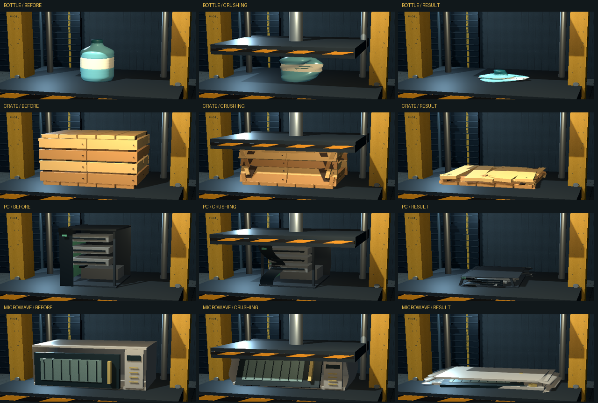

# Crush Factory

## Hydraulic Press Simulator

**Choose it. Crush it. Get paid.**


> A small, open-source Godot prototype about the satisfying difference between folding cardboard, buckling metal, rebounding rubber, and breaking down household scrap.

[](https://godotengine.org/)
[](https://github.com/)
[](DEVELOPMENT_PLAN.md)
[](LICENSE)

## 中文简介

这是一个使用 Godot 4.7.2 制作的液压机解压游戏原型。玩家选择废弃物，启动液压机，观察不同材料的结构破坏，领取回收奖励并升级压力等级。

当前 M6 原型包含七种物品：纸箱、铝罐、轮胎、塑料瓶、木箱、PC 机箱和微波炉。M6 已完成开发交付，正在等待视觉验收；它不是最终商业版本，也没有 Steam、联网或账号依赖。

## Play the Windows build

Download the latest Windows x64 ZIP from the repository's **Releases** page, extract it, and double-click `CrushFactory.exe`.

The current review package is `0.6.0-m6-review.1`. It was tested at 1280×720 on Intel UHD with the Compatibility renderer. The downloadable build is self-contained and does not require Godot, .NET, a network connection, or an account.

## Screenshots



More full-size captures and captions are in [docs/SCREENSHOTS.md](docs/SCREENSHOTS.md).

## What changes when you crush it?

| Object | Material behaviour | Unlock |
| --- | --- | --- |
| Plastic Bottle | Thin PET wall pinches, creases, and keeps a small dent after unloading | Level 1 |
| Cardboard Box | Local folds, asymmetric wall buckling, permanent collapse | Level 1 |
| Aluminum Can | Local dents, ring folds, staged metal buckling, plastic deformation | Level 1 |
| Rubber Tire | Elastic resistance, sidewall bulge, oval centre hole, controlled rebound and residual damage | Level 2 |
| Wooden Crate | Planks resist first, joints fail, boards rotate and stack under constraint | Level 3 |
| PC Tower | Thin shell dents first, then drives and a simplified internal frame compress | Level 3 |
| Microwave Oven | Wide shell buckles while an independent door tilts into the cavity | Level 4 |

The press uses a deterministic controller and bounded material solvers. Visual meshes update frequently; simplified collision shapes update at a lower cadence. Each material has its own deformation strategy, while the machine, reward, audio, and save systems are shared.

## Controls

| Action | Keyboard / mouse |
| --- | --- |
| Press / pause / continue | `Space` |
| Return the plate | `R` |
| Collect reward | `C` |
| Choose a new object | `N` |
| Open upgrades | `U` |
| Toggle debug HUD | `F3` |
| Toggle sound | `M` |
| Front / side camera | `1` / `2` |
| Orbit camera | Hold right mouse button and drag |
| Zoom | Mouse wheel |
| Quit | `Esc` |

## Run from source

1. Install the official **Godot 4.7.2 standard** editor.
2. Clone this repository and open `project.godot`.
3. Press `F6` or `F5` to run the gameplay scene.
4. Use the standard Godot console to run an individual test, for example:

   ```powershell
   tools/godot/Godot_v4.7.2-stable_win64_console.exe --headless --path . --script tests/content_test.gd
   ```

The repository does not include the Godot editor binary, export templates, FFmpeg, old recordings, or local save files. `tools/build_m6.ps1` documents the local test and Windows export flow; install Godot and provide matching 4.7.2 templates before using it.

## Verification snapshot

- 7 objects, 4 pressure levels: 80 / 100 / 140 / 180.
- 28 complete gameplay cycles in the M6 review run, failure count 0.
- Original cardboard, aluminum, and tire visual regression: 32/32 full frames identical.
- Intel UHD, 1280×720, Compatibility: average 59.20 FPS, P95 18.92 ms, P99 21.46 ms in the no-capture run.
- Full gameplay recording: 211.60 seconds, including a real exit and a second-process save/load check.

See [records/m6-review01/M6_REVIEW.md](records/m6-review01/M6_REVIEW.md) for the detailed evidence and known limitations. The M6 review is intentionally not marked as a user-accepted stable milestone yet.

## Project documents

- [Development plan and milestone gates](DEVELOPMENT_PLAN.md)
- [M6 review report](records/m6-review01/M6_REVIEW.md)
- [Screenshots and captions](docs/SCREENSHOTS.md)
- [GitHub page copy](docs/GITHUB_METADATA.md)
- [Design and implementation notes](DESIGN.md)
- [Asset and third-party license list](ASSET_LICENSES.md)
- [Contributing guide](CONTRIBUTING.md)

## Scope and limitations

This is a deliberately small vertical-slice prototype: one press, one workshop, one object at a time, procedural deformation, local save data, and no online services. The new meshes are original gameplay prototypes rather than final production art. The Windows executable is unsigned, and compatibility on other hardware has not been promised.

## License

The project code and original project assets are released under the [MIT License](LICENSE). Godot and other bundled notices retain their own licenses in [licenses/](licenses/) and [ASSET_LICENSES.md](ASSET_LICENSES.md).

Contributions, bug reports, and screenshots from other hardware are welcome. Please read [CONTRIBUTING.md](CONTRIBUTING.md) first.

---

## English summary

Crush Factory is a deterministic, material-driven hydraulic press simulator prototype. It is a Godot 4.7.2 Windows game about choosing scrap, watching it fail in a material-specific way, collecting the reward, and upgrading the press. The current public package is an M6 review build with seven objects. It is open source, offline, and intentionally small.
