# Screenshots

这些图片来自 M6 review 01 的真实 Godot 运行过程，分辨率为 1280×720。每个物品保留未压缩、压缩中和最终状态三张代表图；`content-overview.png` 是适合 README 的总览图。

## Overview

## Plastic Bottle

薄 PET 壁先局部瘪陷，卸载后只恢复一部分。

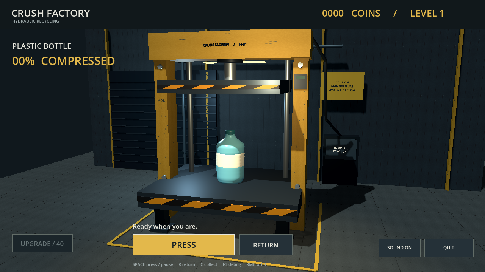
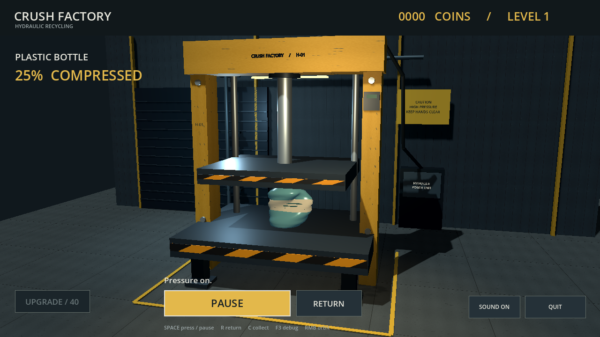
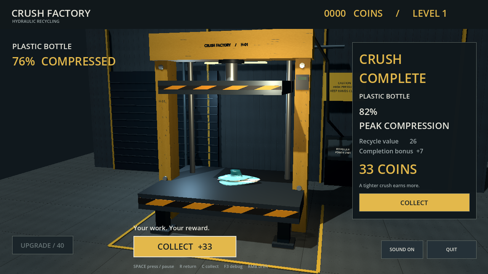

## Cardboard Box

侧壁局部折叠、非对称失稳和永久塌陷。

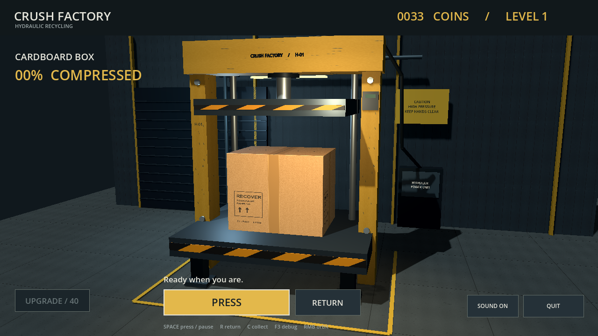
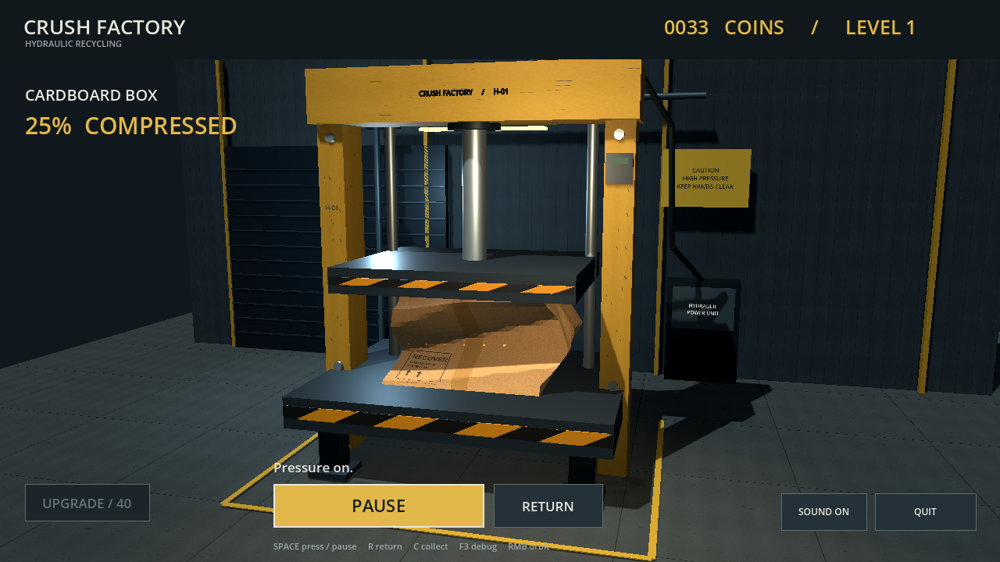
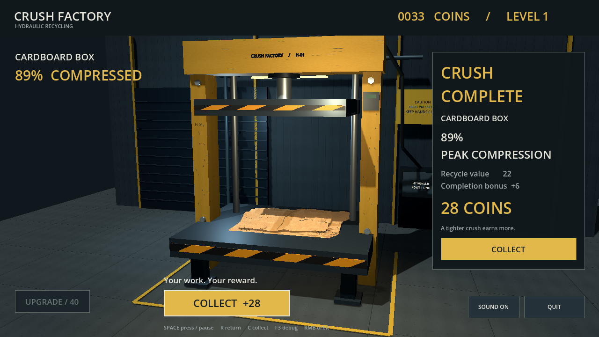

## Aluminum Can

局部凹陷、环形折皱和分阶段金属屈曲。

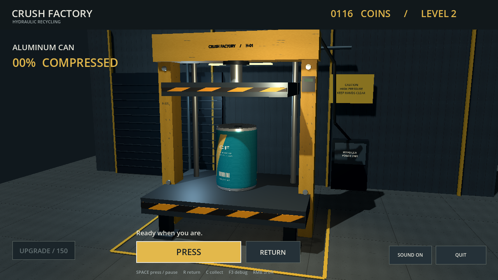
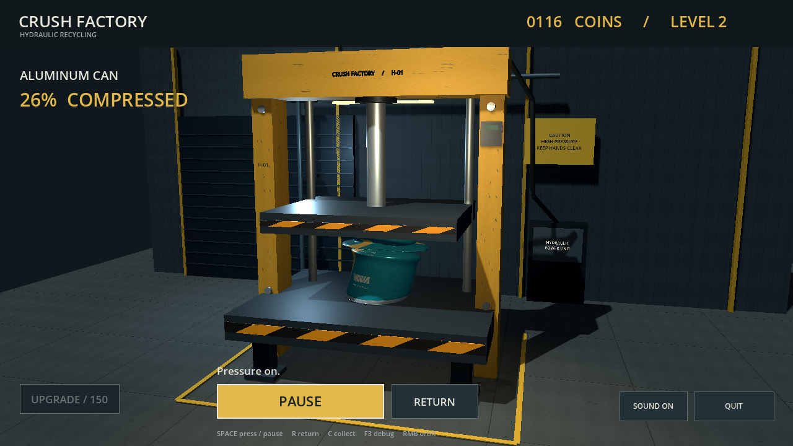

## Rubber Tire

侧壁鼓出、中心孔椭圆化、回程回弹和残留损伤。

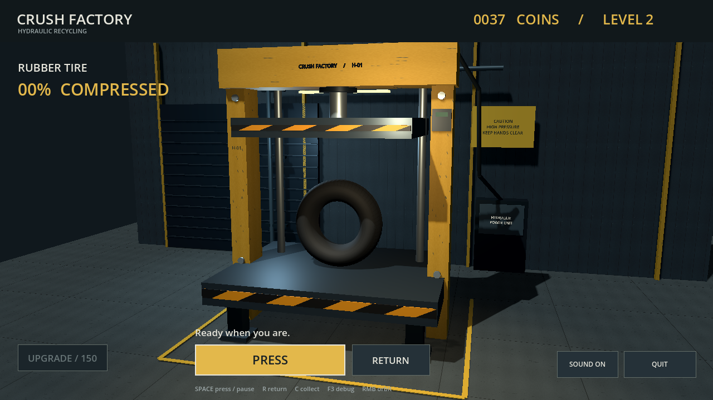

## Wooden Crate

木板和连接处分阶段失效，板件受约束错层堆叠。

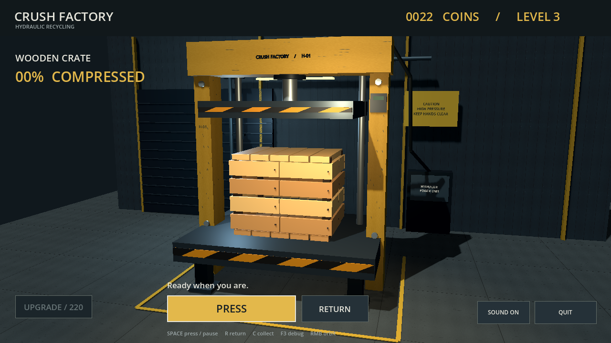
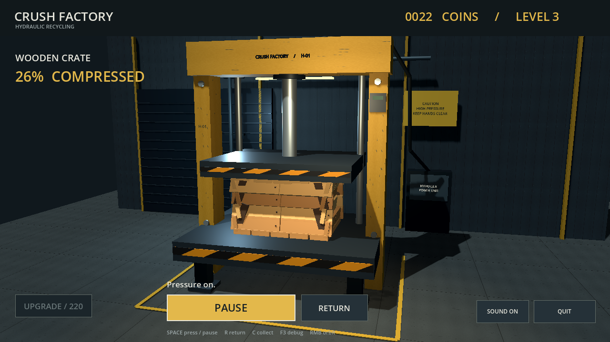
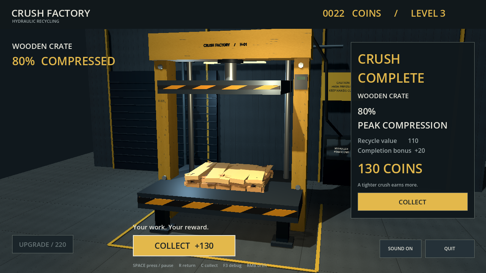

## PC Tower

外壳先凹陷，内部机架、硬盘位和简化部件再逐步压缩。

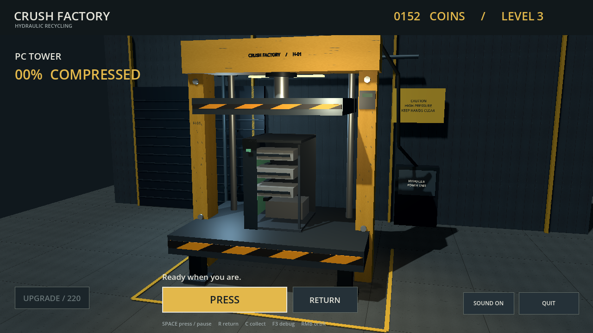
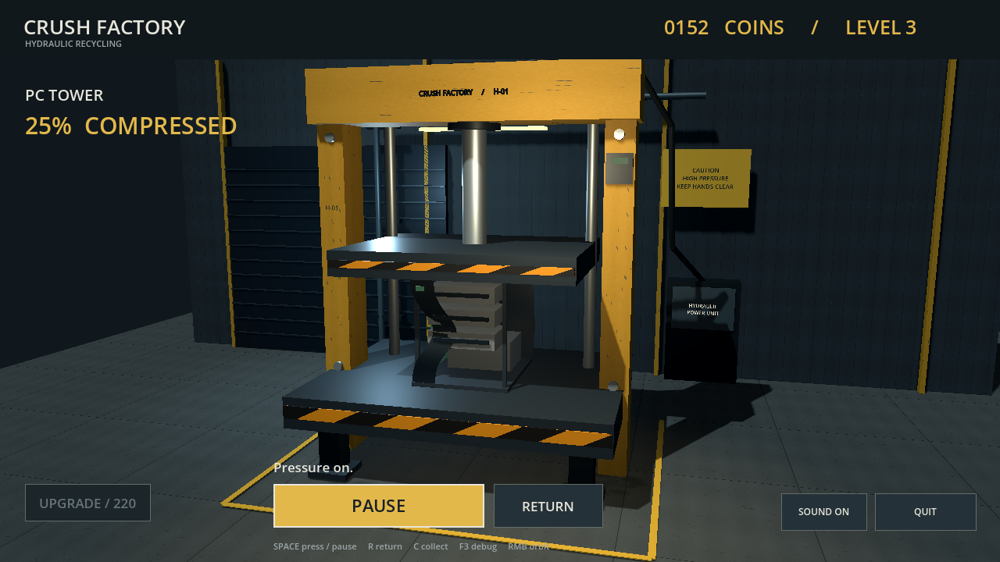
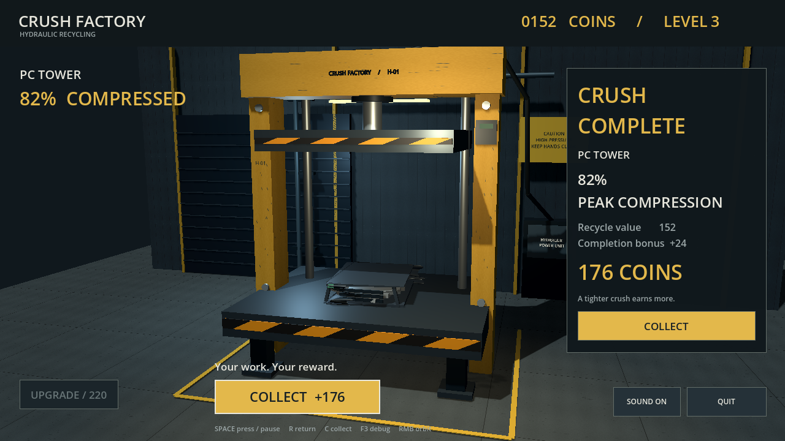

## Microwave Oven

宽外壳屈曲，独立门板绕下缘倾斜并塌入腔体。

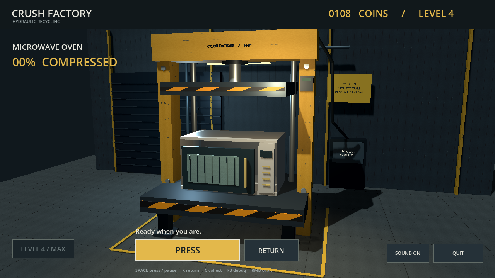
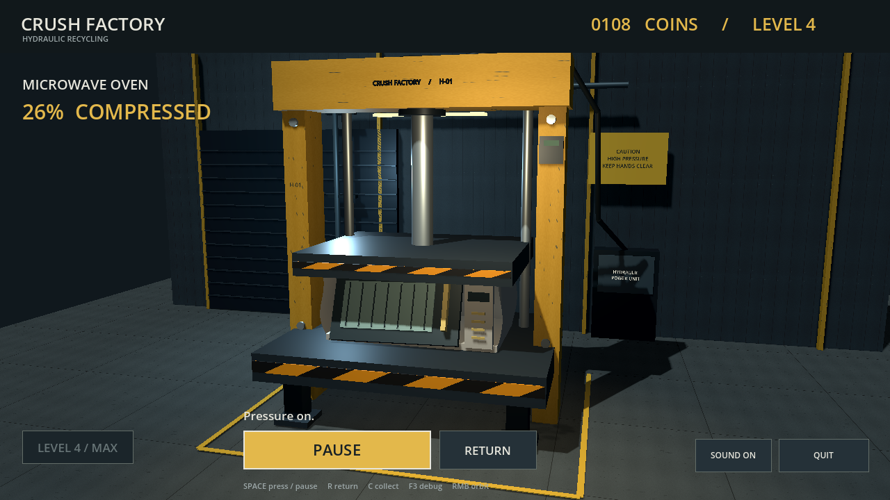
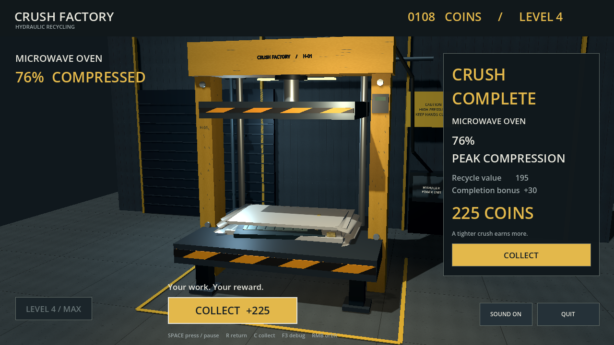

## Evidence

完整视频、测试 JSON、性能记录和已知问题见 [`records/m6-review01/`](../records/m6-review01/)。视频文件较大，公开仓库建议作为 GitHub Release asset 提供，不放进源码历史。
